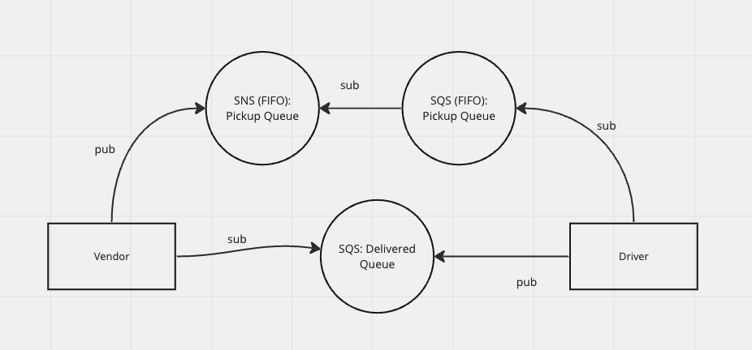

# caps-cloud

Implementing a delivery notification system using AWS SQS and SNS.

The vendor publishes a pickup message to SNS, while a SQS is subscribed to the same SNS. The driver subscribes to the SQS to be notified for a pickup. Once delivered, the driver publishes to another SQS, where the vendor is subscribed to be notified of delivery.

## UML

## Expected Output

